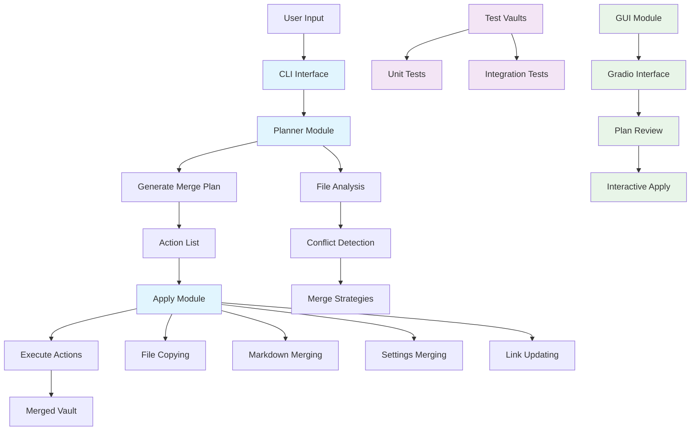
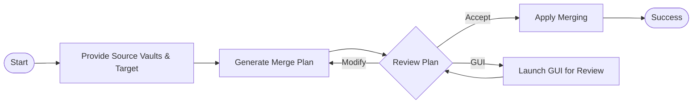

# Obsidian Bracelet

A uv-managed Python tool to integrate multiple Obsidian vaults into a new merged vault with safe conflict handling and a review GUI for user approval before applying changes.

## Installation

```bash
pip install obsidian-bracelet
```

Or from source:

```bash
git clone <repo>
cd obsidian-bracelet
uv sync --extra dev
```

## Architecture Diagram



## Usage Flow



## Key Features

- **Intelligent Merging**: Automatically detects file conflicts and merges markdown content with source attribution.
- **Resource Management**: Moves linked files (CSV, images, etc.) to `!res/` directory and updates links.
- **Conflict Resolution**: Handles filename collisions, identical content deduplication, and settings merging.
- **GUI Review**: Optional graphical interface for reviewing merge plans before execution.
- **Edge Case Handling**: Gracefully manages empty vaults, invalid structures, and permission issues.

## File Structure

```
obsidian-bracelet/
├── src/obsidian_bracelet/
│   ├── __init__.py
│   ├── cli.py           # Command-line interface
│   ├── planner.py       # Merge planning logic
│   ├── apply.py         # Action execution
│   └── gui.py           # Gradio-based GUI
├── tests/               # Unit tests
├── test-vaults/         # Test data
│   ├── personal-vault/
│   ├── work-vault/
│   └── merged-vault/
├── pyproject.toml       # Project configuration
└── README.md
```

## Usage Examples

### Basic Merging
```bash
obsidian-bracelet-merge plan -s vault1 -s vault2 -t merged
obsidian-bracelet-merge apply merged/plan.json
```

### With GUI
```bash
obsidian-bracelet-merge-gui --plan-file merged/plan.json
```

### Dry Run
```bash
obsidian-bracelet-merge apply merged/plan.json --dry-run
```

## Running the GUI

To launch the web-based GUI for reviewing and applying merge plans:

```bash
obsidian-bracelet-gui
```

Or from source:

```bash
uv run python -m obsidian_bracelet.gui
```

This starts a Flask web server at http://127.0.0.1:5000 where you can:

- Enter source vault paths and target path
- Build a merge plan
- Review the actions in a table
- Apply the plan with or without dry run

## Benefits

- **Knowledge Integration**: Combine multiple Obsidian vaults without losing information.
- **Conflict Awareness**: Clear indication of content origins in merged files.
- **Organization**: Automatic organization of resources and settings.
- **Safety**: Review plans before applying changes.
- **Flexibility**: CLI and GUI interfaces for different user preferences.

